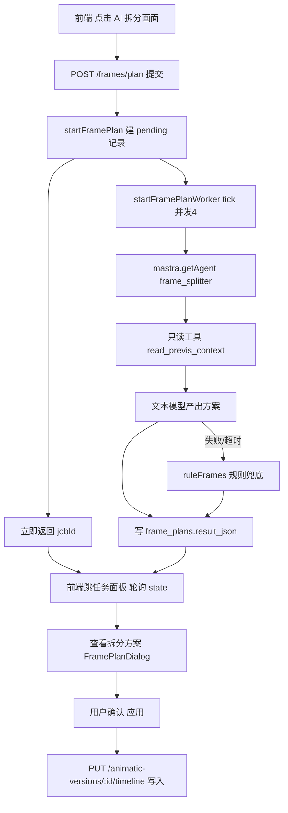

## 产品概述

把「镜头 → 分镜画面 AI 拆分」从当前的临时实现（代码里现写 Agent、硬编码提示词、同步阻塞接口）升级为与「分镜拆解（storyboard_breaker）」同构的**标准 Agent 机制 + 异步任务**实现，同时保留既定的产品口径：AI 优先、规则兜底、每个镜头 2-6 张画面、仅空镜头生效（force 才重拆）、**Agent 只产出方案，用户预览确认后才写入时间线**。

## 核心功能

- 标准 Agent：`frame_splitter` 注册进 Mastra Agent 注册表，提示词走 `workspace/prompts/frame_splitter.md`（含中/英/日/韩变体）并有代码兜底，带只读工具读取镜头上下文，可挂项目技能目录，模型按「提示词文件 → 请求覆盖 → 启用文本配置」解析，在设置页可见可改。
- 异步任务化：提交立即返回，任务面板显示「拆分中 x/N」进度，刷新不丢、失败可重试，完成后「查看拆分方案」。
- 预览确认后写入：Agent/任务只产出方案（标题、提示词、时间点、画面类型），用户确认后由前端走既有 `PUT /animatic-versions/:id/timeline` 写入，带 revision 校验。
- 保留能力：AI 失败/超时自动回退规则拆分（按时长均分 + 描述分句）；按时长建议画面数；已有画面的镜头默认跳过；结果按输入指纹缓存复用。

## 技术栈

沿用项目现有栈：后端 Hono + TypeScript + Drizzle(better-sqlite3) + Mastra Agent（`@mastra/core/agent`、`createTool` + zod），前端 Nuxt 3 + Vue 3。不引入新依赖。

## 实现方案

整体策略是「照抄分镜拆解骨架 + 复用预演模块的异步/租约范式」，把现在的内联 Agent 全部替换掉：

1. **Agent 层（对齐 storyboard_breaker）**

- `backend/src/agents/index.ts`：在 `DEFAULT_PROMPTS` 增加 `frame_splitter`（名称「分镜画面拆分」+ 中文兜底指令），`validAgentTypes` 自动包含它；`AGENT_TOOLS` 增加 `frame_splitter: frameSplitterTools`。
- `backend/agents/tools/frame-splitter-tools.ts`：只提供**只读**工具（不写库），如 `read_previs_context({ versionId, panelIds })`：用 RequestContext 的 `episodeId/dramaId` + 版本时间线，返回镜头标题/描述/氛围/时长/景别/角度/运镜/场景/角色/道具/项目风格提示词；输出结构用 zod 约束。工具内通过 `getEpisodeId()/getDramaId()` 取上下文，与 `storyboard-tools.ts` 风格一致。
- `backend/workspace/prompts/frame_splitter.md`：`---\nname: 分镜画面拆分\nmodel: ""\n---` + 工作流程/硬约束（只依据给定资料、画面按时间推进、提示词可直接生图、只输出 JSON）；补 `.en/.ja/.ko` 变体。
- `backend/src/agents/skills.ts`：`AGENT_SKILL_MAP` 增加 `frame_splitter: ['frame-splitter']`，并在 `workspace/skills/frame-splitter/SKILL.md` 提供初始技能（可选子技能无需改码即可被发现）。
- 设置页 `frontend/app/pages/settings.vue` 的 agent 类型列表增加 `frame_splitter`，并补 4 语言文案（en/ja/ko/zh）。

2. **任务表（复用 continuity_reviews 范式）**

- `backend/src/db/previs-schema.ts` 新增 `framePlans`：`id / versionId / panelId / inputHash / configId / model / count / status(pending|processing|completed|failed) / resultJson / error / createdAt`，唯一索引 `UNIQUE(version_id, panel_id, input_hash)`；在 `initPrevisSchema()` 里 `CREATE TABLE IF NOT EXISTS` + 索引，并用 `PRAGMA table_info` 做老库列补齐，与既有写法一致。

3. **服务重构（`backend/src/services/previs-frames.ts`）**

- 删除内联 `new Agent(...)` 与硬编码 instructions，改为 `mastra.getAgent('frame_splitter')` + `buildAgentRequestContext({ episodeId, dramaId, modelOverride, textConfigId })`。
- `startFramePlan(versionId, { panelIds, count, configId, model, force })`：校验 revision/锁定/已有画面 → 按面板建 `pending` 记录（相同 inputHash 且 completed 直接复用）→ **立即返回**，不 await 模型。
- `tickFramePlans()` + `startFramePlanWorker()`：事务 claim（借鉴 `continuity-review.ts` 的 `processing` + 30 分钟租约 + 内存 active Map 去重），并发 4（复用现有 `mapLimit`），逐个调用 Agent；失败/超时/解析失败回退 `ruleFrames()`；结果写 `result_json`（completed）或 `error`（failed）。**全程不写 timeline**。
- `recoverFramePlans()`：启动时把残留 `processing` 且租约过期的记录重置为 `pending`。
- 保留并导出纯函数：`suggestedFrameCount` / `clampCount` / `ruleFrames` / `frameTypeAt` / `offsetAt`；新增 `listFramePlans()`、`getFramePlanResult()`、`retryFramePlans()`、`inputHash`（复用 `hashContent`）。

4. **路由与轮询**

- `backend/src/routes/previs.ts`：`POST /animatic-versions/:id/frames/plan` 改为提交（返回 `{ jobId, queued }`）；新增 `GET /animatic-versions/:id/frames/plan`（返回各面板状态与已完成方案）、`POST .../frames/plan/retry`、`POST .../frames/plan/cancel`。
- `getVersionState` / `getWorkspaceState` 附带 `framePlans`（pending/processing/completed/failed 计数 + 已完成 panelId），前端既有 2.5s 轮询即可展示进度，无需新增轮询。
- `backend/src/index.ts`：启动 `startFramePlanWorker()`（与 `startPrevisWorker()` 并列）。

5. **前端改造**

- `usePrevis.ts`：`requestFramePlan` 改为提交 + `fetchFramePlans` 查询；`PanelFramePlan` 类型沿用。
- `previs.vue`：`runFramePlan` 提交后跳到「任务」面板显示「拆分中 x/N」；轮询到完成显示「查看拆分方案」按钮 → 打开 `FramePlanDialog` 确认 → `applyFramePlan()` 走 `edit()` + `PUT timeline` 写入（保留 revision 校验与撤销栈）；删除 5 个一批的串行 CHUNK 逻辑与本地计时器。
- `StoryboardFramesEditor.vue`：按钮改为「提交拆分任务」，提交中显示「已提交，正在拆分…」，完成后显示「查看方案 N 张」。

## 架构设计



## 目录结构

```
backend/
├── src/
│   ├── agents/
│   │   ├── index.ts                          # [MODIFY] DEFAULT_PROMPTS 增加 frame_splitter；AGENT_TOOLS 挂载只读工具
│   │   ├── skills.ts                         # [MODIFY] AGENT_SKILL_MAP 增加 frame-splitter 技能目录
│   │   └── tools/frame-splitter-tools.ts     # [NEW] 只读工具 read_previs_context（zod 校验，RequestContext 取 episodeId/dramaId）
│   ├── db/previs-schema.ts                   # [MODIFY] 新增 frame_plans 表定义 + initPrevisSchema 建表/补列/索引
│   ├── services/previs-frames.ts             # [MODIFY] 删除内联 Agent；改为提交/查询/重试 + worker（claim 租约、并发4、规则兜底、结果不写 timeline）
│   ├── routes/previs.ts                      # [MODIFY] 提交型 POST、状态 GET、重试/取消；state 附带 framePlans 进度
│   └── index.ts                              # [MODIFY] 启动 startFramePlanWorker
└── workspace/
    ├── prompts/frame_splitter.md             # [NEW] 提示词（front-matter name/model）+ .en/.ja/.ko 变体
    └── skills/frame-splitter/SKILL.md        # [NEW] 初始项目技能
frontend/app/
├── composables/usePrevis.ts                  # [MODIFY] 提交/查询接口与类型
├── views/drama/previs.vue                    # [MODIFY] 提交后跳任务面板、进度显示、完成后打开方案窗确认写入
└── components/previs/
    ├── StoryboardFramesEditor.vue            # [MODIFY] 按钮语义改为提交任务/查看方案
    └── FramePlanDialog.vue                   # [MODIFY] 支持从任务结果载入方案（watch plans 已有）
settings.vue / locales/*.json                 # [MODIFY] Agent 类型列表与 4 语言文案
```

## 关键代码结构

```ts
// backend/src/db/previs-schema.ts（新增，范式同 continuityReviews）
export const framePlans = sqliteTable('frame_plans', {
  id: integer('id').primaryKey({ autoIncrement: true }),
  versionId: integer('version_id').notNull(),
  panelId: integer('panel_id').notNull(),
  inputHash: text('input_hash').notNull(),
  configId: integer('config_id').notNull(),
  model: text('model').notNull(),
  count: integer('count').notNull(),
  status: text('status').notNull().default('pending'),
  resultJson: text('result_json').notNull().default(''),
  error: text('error'),
  createdAt: text('created_at').notNull(),
}, table => [uniqueIndex('idx_frame_plan_input').on(table.versionId, table.panelId, table.inputHash)])
```

```ts
// backend/src/services/previs-frames.ts（对外接口签名）
export interface FramePlanDraft { title: string; prompt: string; offsetMs: number; type: FrameType }
export interface PanelFramePlan { panelId: number; panelTitle: string; count: number; source: 'ai' | 'rule'; frames: FramePlanDraft[] }
export function startFramePlan(versionId: number, options: PlanFramesOptions): { jobId: string; queued: number }
export function listFramePlans(versionId: number): { items: FramePlanStatus[]; plans: PanelFramePlan[] }
export function retryFramePlans(versionId: number, panelIds: number[]): { queued: number }
export function startFramePlanWorker(): Promise<() => void>
```

## 实现注意事项

- 删除 `previs-frames.ts` 中的 `plannerInstructions` 与 `new Agent({ id: 'frame-splitter' ... })`，避免两套提示词并存。
- Agent 工具保持只读：写入只允许发生在用户确认后的 `saveTimeline`（保障 `locked` 版本不可变触发器与 revision 语义）。
- 并发与费用：worker 并发 4；同一 (versionId, panelId, inputHash) 已完成结果默认复用，`force` 才重算。
- 状态一致性：任务只在 `frame_plans` 落进度，`busy` 判定需把进行中的拆分计入，避免用户同时保存造成 revision 冲突。
- 前端轮询复用既有 2.5s 轮询，不新增定时器；完成时提示「可点击查看方案」。

## Agent Extensions

### SubAgent

- **code-explorer**
- 用途：在改造前精确定位所有受影响调用点（`DEFAULT_PROMPTS`/`AGENT_TOOLS`/`AGENT_SKILL_MAP` 的注册点、`initPrevisSchema` 迁移位置、`getVersionState`/`getWorkspaceState` 返回值的所有消费方、前端 `requestFramePlan` 的全部调用处）。
- 预期结果：给出完整受影响文件清单，避免漏改导致编译或状态不同步。

### Skill

- **agent-browser**
- 用途：端到端验证（打开故事版页 → 点击拆分 → 任务面板看进度 → 完成后打开方案 → 应用 → 确认时间线写入），并抓取控制台报错。
- 预期结果：截图与快照证明「提交即返回、进度可见、完成后可确认写入」；测试数据最后还原。